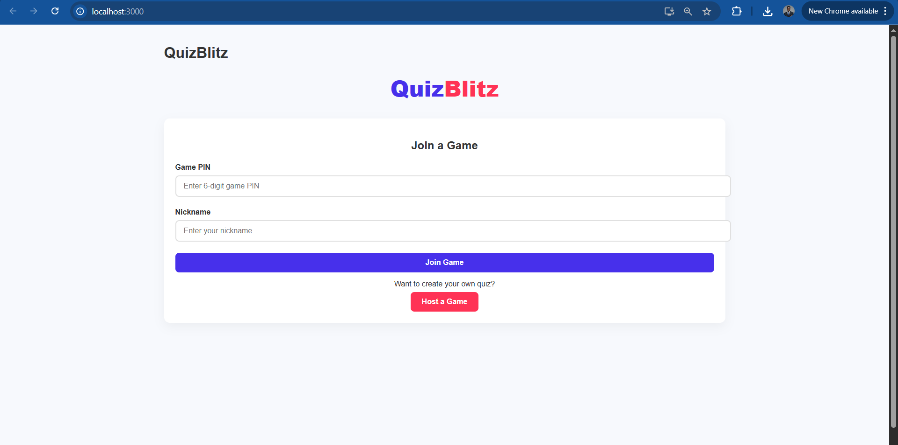
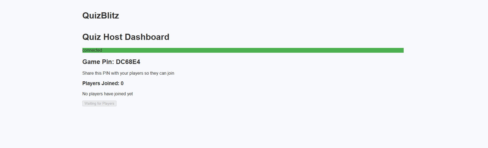
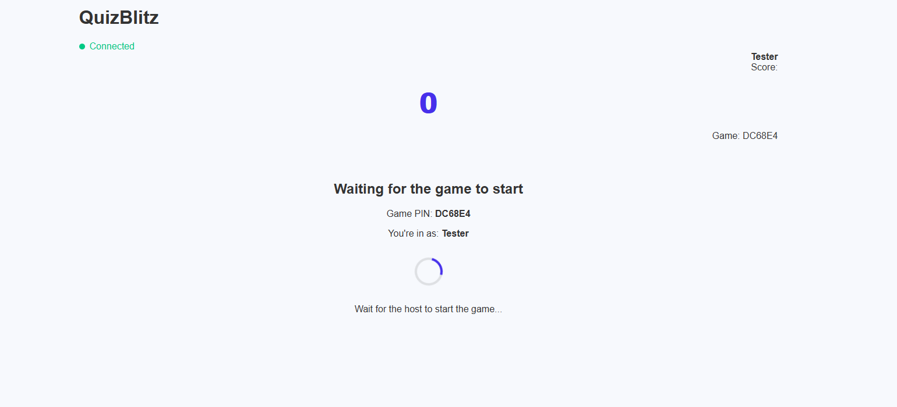
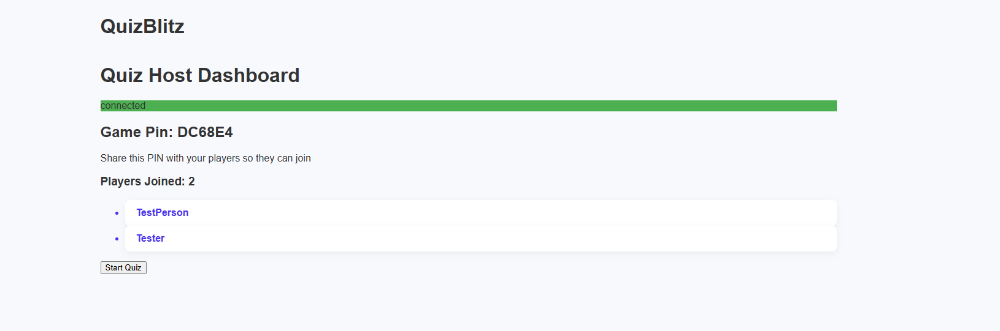
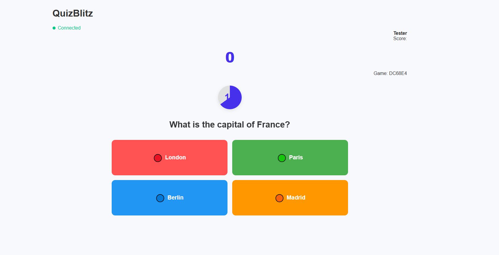

# QuizBlitz ⚡

A real-time multiplayer quiz platform built with React, FastAPI, and WebSockets







## 🚀 Quick Start

### Prerequisites
- Node.js 16+ & npm
- Python 3.10+
- MongoDB
- Redis
- React.js (Client)

## 🛠️ Installation

### Backend Setup
```bash
cd server
python -m venv venv
source venv/bin/activate  # Linux/Mac
venv\Scripts\activate    # Windows
pip install -r requirements.txt

# Create environment file
echo "MONGO_CONNECTION_STRING=mongodb+srv://<user>:<password>@cluster0.lerychw.mongodb.net/" > app/.env
```

### Frontend Setup
```bash
cd client
npm install
```

## ⚙️ Configuration
Update API endpoints in:
- `client/src/hostScreen.jsx`
- `client/src/playerScreen.jsx` 
- `client/src/joinScreen.jsx`

Replace `localhost:8000` with your server URL if needed

## 🏃 Running the Application

1. **Start Redis**
```bash
redis-server
```

2. **Launch Backend**
```bash
cd server
uvicorn app.main:app --reload
```

3. **Start Frontend**
```bash
cd client
npm start
```

### Host Experience
1. Create new game from Host Dashboard
2. Share 6-digit game PIN with players
3. Control quiz flow (start/next question)
4. Monitor live leaderboard

### Player Experience
1. Join with game PIN & nickname
2. Answer questions in real-time
3. Receive instant feedback
4. Track position on live leaderboard

## ✨ Key Features
- Real-time WebSocket communication
- Auto-reconnect functionality
- Animated score updates
- Redis-backed connection management
- MongoDB game state persistence
- Responsive UI with progress indicators

## 📌 Important Notes
1. Keep both server and client running simultaneously
2. Default API runs on port 8000, client on 3000
3. Requires active MongoDB and Redis instances
4. Demo quiz data in `server/app/services/default_quiz.json`

Access at: http://localhost:3000
